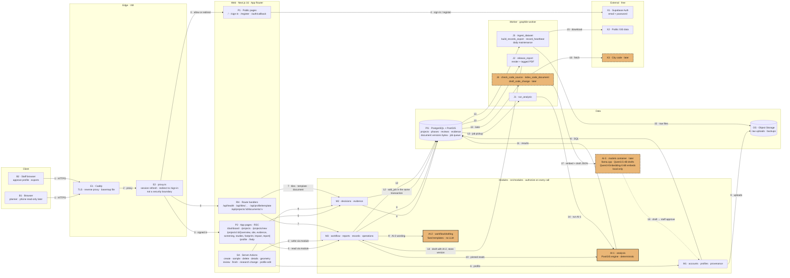
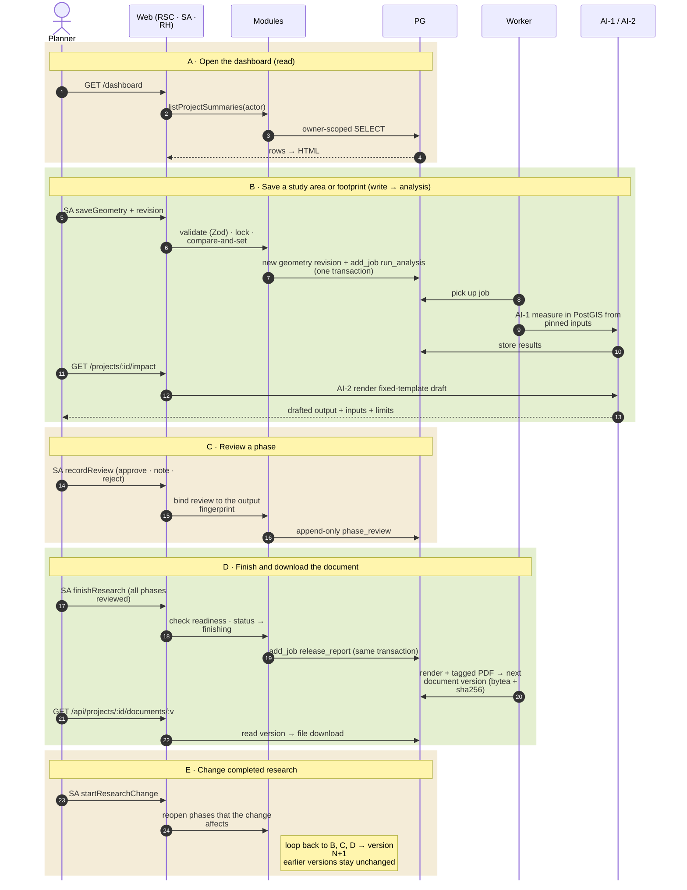

# UPlan — Application Architecture Diagram

**Status:** Draft — a one-page visual map of the application as built, with where automation and AI sit
**Last updated:** 2026-10-03
**Related:** [system-architecture.md](system-architecture.md) (hosting, VM, budget) · [research-phases.md](research-phases.md) (phase drafting) · [project-dashboard.md](project-dashboard.md) (pages) · [data-model.md](data-model.md)

This page shows how a request travels through UPlan and marks every place that does automated "AI-like" work. It adds no design of its own: where it and another TechDesign doc disagree, the other doc wins and this page is wrong.

## Read this first: what "AI" means in UPlan today

| Tag | What it is | Is it a language model? | Status |
| --- | --- | --- | --- |
| **AI-1** | **Analysis engine** (`analysis`, job J2): measures areas, buffers, and overlaps in PostGIS from pinned inputs | No. Deterministic SQL | Built |
| **AI-2** | **Phase drafting** (`workflow/drafting.ts`): turns the measured numbers into a headline and plain sentences using fixed templates | No. Fixed wording; a test fails on any verdict-shaped word | Built |
| **AI-3** | **Code-change drafting** (F2: `models` container, jobs J7–J9): reads a city's code, retrieves passages, and drafts a *profile rule change* with an exact quote | **Yes.** Local open models on the VM, never an external API | Designed, **not built** (dashed in the diagram) |

UPlan never uses a model to write findings, recommendations, or conditions. The only model, AI-3, drafts profile rules, and staff confirm each draft before any project can use it.

## Diagram 1 — System map

Boxes are grouped by layer. Arrows point from the part that starts the exchange. The gold boxes are AI-1, AI-2, and AI-3.

## Diagram 2 — Request routes

Each row is one route a person or a monitor can hit. Every route ends in a module function that checks access itself.

## Route table

| Kind | Route | Auth | Calls | Result |
| --- | --- | --- | --- | --- |
| Page | `/` | Public | none | Landing |
| Page | `/sign-in`, `/register` | Public | SA → X1 | Session cookie |
| RH | `/auth/callback` | Public | X1 | Confirms an emailed link |
| Page | `/dashboard` | Signed in | `workflow`, `profiles` | Current and completed research, city profile |
| Page | `/projects`, `/projects/new` | Signed in | `workflow`, `decisions` | List; create form |
| Page | `/projects/:id/overview … /report` | Owner only | `workflow`, `analysis`, `reports` | Eight phase pages, each with drafted output, inputs, and review |
| Page | `/profile`, `/help` | Signed in | `profiles` | City rules and settings; guidance |
| SA | project actions | Owner only | `decisions`, `workflow`, `reports` | Create, sample, delete, details, geometry, review, finish, research change |
| SA | profile actions | Signed in; staff approve | `profiles` | Upload, edit, preview, approve |
| RH | `/api/projects/:id/documents/:v` | Owner only | `reports` | Document version download |
| RH | `/api/tiles/:version/:z/:x/:y` | Public path, no decision data | `evidence` | Vector tile from PostGIS |
| RH | `/api/profile/template` | Signed in | `profiles` | Excel template |
| RH | `/api/health` | Public | `operations` | Database and worker heartbeat check |

## Key

### Abbreviations

| Short | Meaning |
| --- | --- |
| RSC | React Server Component: a page that renders on the server |
| SA | Server Action (Server Function): a form or button that writes |
| RH | Route handler: an `/api/…` or `/auth/…` endpoint |
| PG | PostgreSQL with PostGIS: the one database |
| OS | Oracle Object Storage (S3 API) |
| F2 | The code-tracking feature that uses a model |
| AI-1 / AI-2 / AI-3 | The three automated parts described under "Read this first" |

### Boxes

| Box | Meaning |
| --- | --- |
| B1 | A planner's browser. Phone use is read-only and later |
| B2 | UPlan staff in a browser: approve profile changes, export records |
| E1 | Caddy on the VM: HTTPS, forwards requests, serves the basemap. The only container with open ports |
| E2 | `proxy.ts`: refreshes the session and redirects signed-out visits. A convenience, not security |
| P1 | Pages anyone can open |
| P2 | Pages for signed-in planners. Each one reads through a module |
| SA | Writes. Validate, then call one module function |
| RH | Downloads, tiles, the health check, and the email link callback |
| M1 | Sign-in wiring, city profile and rules, the provenance formatter |
| M2 | Projects (decisions), study areas and footprints, evidence datasets |
| M3 | Phases and reviews, the document, records export, health |
| AI-1 | **AI.** The analysis engine: PostGIS measurements, same inputs give the same results. Not a language model |
| AI-2 | **AI.** Phase drafting: fixed sentence templates over the measured numbers. Not a language model |
| AI-3 | **AI, later.** Local models on the VM that draft profile rule changes with an exact quote. Staff confirm each. Dashed because it is not built |
| J1 | Job `run_analysis`: runs AI-1 for one project |
| J2 | Job `release_report`: renders the document and stores the next version |
| J3 | The other jobs: dataset ingest, profile preview, records export, heartbeat, daily maintenance |
| J4 | F2 jobs: check a code source, index it, draft a change. Later |
| PG | Holds projects, reviews, evidence, document versions (bytea with sha256), and the job queue |
| OS | Holds raw uploads and backups. Documents are **not** here |
| X1 | Supabase Auth: email and password |
| X2 | Free public GIS data that J3 downloads |
| X3 | The city's published code that J4 reads. Later |

### Arrows

| Arrow | Meaning |
| --- | --- |
| Solid line | A call that happens while the app is in use |
| Dotted line | A hand-off that needs a person, here a staff approval, before it has effect |
| Number on a line | The order along that path in Diagram 1 (1 → 18). Several lines can share a number when they are alternatives |
| Gold box | Automated drafting or analysis (AI-1, AI-2, AI-3) |
| Dashed box | Designed but not built yet |
| Steps 1–3 | Request reaches Caddy, passes the session check, lands on a page or route |
| Steps 4–9 | Page or action calls a module, which reads or writes PG (and OS for uploads) |
| Steps 10–11 | A module asks AI-1 for pinned measurements; results are stored |
| Step 12 | A write queues its job in the same transaction as the change |
| Steps 13–17 | The worker picks up the job and runs AI-1, document rendering, ingest, or F2 |
| Step 18 | An AI-3 draft goes to staff approval; it never reaches a project directly |
| Sequence diagram `->>` | A request or call |
| Sequence diagram `-->>` | A response |
| Sequence diagram coloured bands | The five flows: A read, B write and analyse, C review, D finish and download, E change |

### Rules the diagram shows

- **Authorization is in the modules**, not `proxy.ts` (E2).
- **Slow work is a job.** A write adds its job in the same transaction (step 12), so a job never exists without its change.
- **Documents live in PG.** Each version is stored once with a hash and never edited; a research change adds a new version.
- **No language model writes findings.** AI-1 and AI-2 are deterministic; AI-3 drafts rules only, and only after staff approval.
