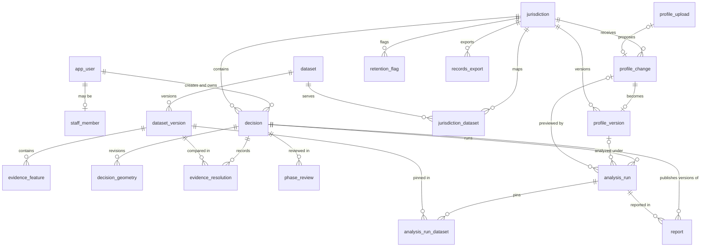

# UPlan — Data Model

**Status:** Draft — system-level technical design
**Last updated:** 2026-09-27
**Derived from:** [charter.md](../Requirements/charter.md), [features.md](../Requirements/features.md)
**Related:** [tech-stack.md](tech-stack.md) · [system-architecture.md](system-architecture.md) · [alternatives-and-tradeoffs.md](alternatives-and-tradeoffs.md)

The SQL below is the design target for release 1, plus F2's tables, which are marked later in v1. Drizzle schema files and generated migrations must produce exactly these constraints. The constraints aren't decoration: they are how the system prevents races and keeps released records honest (see _Concurrency and consistency_ in the architecture).

## Conventions in this model

- Primary keys are `uuid` from `gen_random_uuid()`. `app_user` is the exception: its id is `text`, because it began as Better Auth's id and every reference to a person points at it.
- Tables and columns are `snake_case`, and table names are singular.
- `*_at` columns are `timestamptz` in UTC. `*_on` columns are `date`, used for legal dates such as effective and filing dates.
- A status is `text` with a `CHECK` list, not a PostgreSQL enum, so adding a state is a one-line migration.
- Geometry is stored in EPSG:4326 and measured after transforming to the jurisdiction's `analysis_srid`.
- No column has a default that stands in for missing information. The only defaults are generated ids and creation timestamps.
- The database uses the `postgis` extension, plus `vector` (pgvector) once F2 ships.

## Entity map



## Cities and people

Supabase Auth holds identities, passwords, and sessions. `app_user` is UPlan's own record of each person: the `created_by` and `granted_by` columns below reference its `id`, which never changes. There is no membership table (removed 2026-09-27, `accounts-roles.md`): a project belongs to the person in `decision.created_by`, and `staff_member` is the only extra right. `auth_id` is the Supabase user id that signs in as the person, and is null for someone from before Supabase Auth until an operator links them. `provisionUser` writes it (see `accounts-roles.md`). It is named `app_user` because `user` is a reserved word in PostgreSQL.

```sql
create table app_user (
  id         text primary key default gen_random_uuid()::text,
  auth_id    uuid unique,             -- the Supabase user id; null until linked
  name       text not null,
  email      text not null unique,
  created_at timestamptz not null default now()
);

create table jurisdiction (
  id                         uuid primary key default gen_random_uuid(),
  name                       text not null unique,
  state_code                 char(2) not null,
  time_zone                  text not null,               -- 'America/Los_Angeles'
  analysis_srid              integer not null,            -- 2926 for Sammamish
  boundary                   geometry(MultiPolygon, 4326) not null,
  current_profile_version_id uuid,                        -- null until the first approval; FK below
  created_at                 timestamptz not null default now()
);

create table staff_member (
  user_id    text primary key references app_user (id),
  granted_by text not null references app_user (id),
  granted_at timestamptz not null default now()
);
```

## City profiles (F1, F17)

```sql
create table profile_upload (
  id                uuid primary key default gen_random_uuid(),
  jurisdiction_id   uuid not null references jurisdiction (id),
  object_key        text not null,
  file_sha256       text not null,
  template_version  integer,                  -- null when the file isn't a UPlan template
  validation_errors jsonb not null,           -- [] when valid
  uploaded_by       text not null references app_user (id),
  uploaded_at       timestamptz not null default now(),
  unique (jurisdiction_id, file_sha256),
  check (template_version is not null or jsonb_array_length(validation_errors) > 0)
);

create table profile_change (
  id                uuid primary key default gen_random_uuid(),
  jurisdiction_id   uuid not null references jurisdiction (id),
  base_version_id   uuid,                     -- null only for a city's first profile; FK below
  proposed_document jsonb not null,           -- validated ProfileDocument
  source            text not null check (source in ('upload', 'edit')),
  upload_id         uuid references profile_upload (id),
  reason            text not null check (length(reason) > 0),
  status            text not null check (status in ('pending', 'approved', 'rejected')),
  proposed_by       text not null references app_user (id),
  proposed_at       timestamptz not null default now(),
  decided_by        text references app_user (id),
  decided_at        timestamptz,
  decision_note     text,
  check ((status = 'pending') = (decided_by is null and decided_at is null)),
  check ((source = 'upload') = (upload_id is not null))
);
-- Changed 2026-10-04: a planner's change applies at once, so it is written already 'approved' with
-- decided_by = proposed_by; the no-self-approval check is dropped (migration 0007). 'pending' and
-- 'rejected' remain for F2's staff-confirmed drafts (profile-upload-edit.md, Out of scope).

create table profile_version (
  id              uuid primary key default gen_random_uuid(),
  jurisdiction_id uuid not null references jurisdiction (id),
  version_number  integer not null check (version_number > 0),
  document        jsonb not null,             -- validated ProfileDocument
  document_sha256 text not null,
  change_id       uuid not null unique references profile_change (id),
  created_at      timestamptz not null default now(),
  unique (jurisdiction_id, version_number)
);

alter table profile_change
  add foreign key (base_version_id) references profile_version (id);
alter table jurisdiction
  add foreign key (current_profile_version_id) references profile_version (id);
```

- A change that would drop a resource type that a `jurisdiction_dataset` row still maps to fails with a `ValidationError`.
- `analysis_run` rows with `purpose = 'preview'` have no producer since 2026-10-04 (profile-upload-edit.md R6 withdrawn).

```sql
-- Where a city's rules come from (F17 R12): an editable list, not a record anything depends on.
create table profile_source (
  id              uuid primary key default gen_random_uuid(),
  jurisdiction_id uuid not null references jurisdiction (id),
  kind            text not null check (kind in ('url', 'excel')),
  label           text not null check (length(btrim(label)) > 0),
  url             text,                          -- kind = 'url' only (http or https)
  upload_id       uuid references profile_upload (id),   -- kind = 'excel' only: the workbook behind it
  created_by      text not null references app_user (id),
  created_at      timestamptz not null default now(),
  check ((kind = 'url') = (url is not null)),
  check ((kind = 'excel') = (upload_id is not null))
);
```

## Evidence (F3, F4)

```sql
create table dataset (
  id                 uuid primary key default gen_random_uuid(),
  key                text not null unique,              -- 'nwi-wetlands'
  title              text not null,
  publisher          text not null,
  license            text not null,                     -- a free public license, or it isn't ingested
  source_url         text not null,
  authority          text not null check (authority in ('federal', 'state', 'regional', 'county', 'local')),
  spatial_precision  text not null check (spatial_precision in ('site', 'parcel', 'regional', 'coarse')),
  is_sample          boolean not null default false,    -- F23: illustrative data, labeled everywhere it is shown; false is the truth for every real dataset
  coverage           geometry(MultiPolygon, 4326) not null,
  current_version_id uuid,                              -- null until the first ready version; FK below
  last_checked_at    timestamptz,
  created_at         timestamptz not null default now()
);

create table dataset_version (
  id                   uuid primary key default gen_random_uuid(),
  dataset_id           uuid not null references dataset (id),
  status               text not null check (status in ('ingesting', 'ready', 'failed')),
  raw_object_key       text not null,
  raw_sha256           text not null,
  retrieved_at         timestamptz not null,
  source_as_of         date,                            -- the publisher's own date
  source_as_of_note    text,                            -- required when the publisher states no date
  confidence           text check (confidence in ('high', 'moderate', 'low')),
  confidence_rationale text,
  processing_steps     jsonb not null,                  -- ordered steps, including geometry repair counts
  feature_count        integer,
  error_detail         text,
  check (source_as_of is not null or source_as_of_note is not null),
  check (status <> 'ready' or (confidence is not null and confidence_rationale is not null and feature_count is not null)),
  check (status <> 'failed' or error_detail is not null)
);

create unique index dataset_version_one_per_file
  on dataset_version (dataset_id, raw_sha256) where status <> 'failed';

alter table dataset
  add foreign key (current_version_id) references dataset_version (id);

create table evidence_feature (
  id                 bigint generated always as identity primary key,
  dataset_version_id uuid not null references dataset_version (id),
  source_feature_id  text not null,           -- the publisher's id, or a content hash when it has none
  geom               geometry(Geometry, 4326) not null check (ST_IsValid(geom)),
  attributes         jsonb not null,          -- source attributes UPlan uses, verbatim
  unique (dataset_version_id, source_feature_id)
);

create index evidence_feature_geom on evidence_feature using gist (geom);

create table jurisdiction_dataset (
  jurisdiction_id   uuid not null references jurisdiction (id),
  dataset_id        uuid not null references dataset (id),
  resource_type_key text not null,            -- a resourceTypes[].key in the city's profile
  attribute_map     jsonb not null,           -- source attribute name -> rule attribute name
  primary key (jurisdiction_id, dataset_id)
);
```

- **Provenance (P1).** A figure's provenance is its dataset's publisher, license, and source URL, plus its version's `source_as_of` (or the note when there is none), `retrieved_at`, and confidence. A missing publisher date displays as that note. It is never replaced by `retrieved_at`.
- **Source ids.** The source of `source_feature_id` is recorded in `processing_steps`, so a planner can tell a publisher id from a content hash.

## Decisions and analysis (F5, F7, F8, F9)

```sql
create table decision (
  id                   uuid primary key default gen_random_uuid(),
  jurisdiction_id      uuid not null references jurisdiction (id),
  title                text not null,
  permit_number        text,                    -- null until the city assigns one
  application_type     text not null check (application_type in ('subdivision', 'short_subdivision', 'clearing_grading')),
  application_filed_on date,                    -- required before a run when a rule set vests
  parcel_or_address    text,                    -- null until recorded; shown as "Not yet recorded"
  applicant            text,                    -- null until recorded
  project_manager      text,                    -- null until recorded; a name, entered as text
  target_decision_on   date,                    -- null until recorded
  status               text not null check (status in ('in_progress', 'finishing', 'report_released')),
  row_version          integer not null default 1,   -- compare-and-set for edits to this row
  created_by           text not null references app_user (id),   -- the owner: the only person who can see or change it
  created_at           timestamptz not null default now(),
  deleted_at           timestamptz,             -- soft delete (F20 R5): the row and everything under it stay
  deleted_by           text references app_user (id),
  check ((deleted_at is null) = (deleted_by is null))
);

create index decision_by_owner on decision (created_by, created_at desc) where deleted_at is null;

create table decision_geometry (
  decision_id uuid not null references decision (id),
  kind        text not null check (kind in ('study_area', 'footprint')),
  revision    integer not null check (revision > 0),
  geom        geometry(MultiPolygon, 4326) not null check (ST_IsValid(geom)),
  source_note text not null,                    -- 'Traced from site plan sheet C2.0 dated 2026-08-01'
  created_by  text not null references app_user (id),
  created_at  timestamptz not null default now(),
  primary key (decision_id, kind, revision)     -- two saves of the same revision: the second fails
);

create table analysis_run (
  id                  uuid primary key default gen_random_uuid(),
  decision_id         uuid not null references decision (id),
  purpose             text not null check (purpose in ('current', 'preview')),
  profile_version_id  uuid references profile_version (id),
  profile_change_id   uuid references profile_change (id),
  rules_resolved_for  jsonb not null,           -- {"critical-areas": "2026-09-12", "trees": "2024-05-01"}
  study_area_revision integer not null,
  footprint_revision  integer,                  -- null: evidence base and screening only, no impact
  results_version     integer not null check (results_version > 0),   -- the shape of `results`; part of input_sha256
  input_sha256        text not null,
  status              text not null check (status in ('running', 'succeeded', 'failed')),
  results             jsonb,                    -- AnalysisResults
  error_detail        text,
  started_at          timestamptz not null default now(),
  finished_at         timestamptz,
  unique (decision_id, purpose, input_sha256),
  check ((purpose = 'current') = (profile_version_id is not null and profile_change_id is null)),
  check ((purpose = 'preview') = (profile_change_id is not null and profile_version_id is null)),
  check ((status = 'running') = (finished_at is null)),
  check (status <> 'succeeded' or results is not null),
  check (status <> 'failed' or error_detail is not null)
);

create table analysis_run_dataset (
  analysis_run_id    uuid not null references analysis_run (id),
  dataset_version_id uuid not null references dataset_version (id),
  primary key (analysis_run_id, dataset_version_id)
);

-- A planner's recorded reasoning about one disagreement between two dataset versions (F19).
-- A note only: nothing computes from it, so it can't change a result.
create table evidence_resolution (
  decision_id       uuid not null references decision (id),
  resource_type_key text not null,
  mapped_by         uuid not null references dataset_version (id),
  not_mapped_by     uuid not null references dataset_version (id),
  revision          integer not null check (revision > 0),
  relied_on         text not null check (relied_on in ('mapped_by', 'not_mapped_by', 'neither')),
  rationale         text not null check (length(rationale) > 0),
  created_by        text not null references app_user (id),
  created_at        timestamptz not null default now(),
  primary key (decision_id, resource_type_key, mapped_by, not_mapped_by, revision),
  check (mapped_by <> not_mapped_by)
);

-- A planner's recorded response to one phase's drafted output (F21). Append-only.
create table phase_review (
  id             uuid primary key default gen_random_uuid(),
  decision_id    uuid not null references decision (id),
  phase          text not null check (phase in ('site', 'evidence', 'screening', 'studies', 'footprint', 'impact')),
  content_sha256 text not null,                 -- the fingerprint of the output that was reviewed
  verdict        text not null check (verdict in ('reviewed', 'revision_requested')),
  note           text,
  summary        jsonb not null,                -- { templateVersion, headline, lines } as it was shown
  reviewed_by    text not null references app_user (id),
  reviewed_at    timestamptz not null default now(),
  check (verdict <> 'revision_requested' or (note is not null and length(btrim(note)) > 0))
);

create index phase_review_by_phase on phase_review (decision_id, phase, reviewed_at);
```

- Geometry revisions are never updated or deleted, so a run's revision numbers can't dangle.
- `results_version` is added to a table that already holds finished runs. The migration adds it with `default 1` and then drops the default, so PostgreSQL fills the existing rows without an `UPDATE` (the `analysis_run_final` trigger never fires) and no default remains to stand in for missing information. Readers parse by version: a run at another version than the code's `RESULTS_VERSION` is reported as out of date, never parsed as best it can (see `study-scoping.md`).
- The four project-detail columns on `decision` are nullable because they are facts that may not exist yet, like `permit_number`. Only `application_filed_on` feeds an analysis, and changing it enqueues a run in the same transaction (`decisions.md` R12).
- An _open decision_ has status `in_progress`, and only open decisions re-run when rules or data change, and only they can be edited. `finishing` is the window while a document is generated; publishing sets `report_released`; starting a research change sets `in_progress` again (`research-changes.md`). Every move is a compare-and-set.
- A deleted decision keeps its row and everything under it; only `deleted_at` and `deleted_by` change. Reads filter it out.
- `input_sha256` hashes the sorted list of rules in force, not the date they were resolved for, so a run doesn't go out of date at midnight (`decision-overview.md`, _Pinned inputs_). `rules_resolved_for` records the dates for display.
- A drawn geometry that fails `ST_IsValid` is rejected with a `ValidationError`, never repaired. Only source data is repaired, during ingestion.

## Reports (F10)

```sql
-- One row per attempt to publish a project's final document; a released row is one version (F10, F22).
create table report (
  id                uuid primary key default gen_random_uuid(),
  decision_id       uuid not null references decision (id),
  sequence_number   integer not null check (sequence_number > 0),   -- numbers attempts, so a retry never collides
  version_number    integer check (version_number > 0),             -- numbers published documents; assigned at release, no gaps
  analysis_run_id   uuid not null references analysis_run (id),     -- the run the document is built from
  template_version  integer not null,
  status            text not null check (status in ('releasing', 'released', 'failed')),
  snapshot          jsonb not null,             -- ReportSnapshot: details, phase reviews, what changed (research-changes.md)
  change_note       text,                       -- the reason for this version; required after version 1
  pdf               bytea,                      -- the document itself, kept in the database (F22 R1)
  pdf_sha256        text,
  error_detail      text,
  requested_by      text not null references app_user (id),
  requested_at      timestamptz not null default now(),
  released_at       timestamptz,
  unique (decision_id, sequence_number),
  check ((status = 'released') = (pdf is not null and pdf_sha256 is not null and released_at is not null and version_number is not null)),
  check (status <> 'failed' or error_detail is not null)
);

-- Version numbers are unique per project, and only released rows have one.
create unique index report_one_version on report (decision_id, version_number) where version_number is not null;
```

A failed attempt keeps its row and sequence number as the record of the attempt and takes no version number. The planner finishes again, which creates a new row. `decision.status = 'finishing'` is the one-in-flight guard, so no partial index on `releasing` is needed. A published row is write-once: a trigger (below) rejects every change to it, so the bytes, the hash, and the record can't be altered.

## Records (F16)

```sql
create table retention_flag (
  id              uuid primary key default gen_random_uuid(),
  jurisdiction_id uuid not null references jurisdiction (id),
  record_type     text not null,
  record_id       text not null,
  eligible_on     date not null,              -- from the city's retention setting
  flagged_at      timestamptz not null default now(),
  reviewed_by     text references app_user (id),
  reviewed_at     timestamptz,
  outcome         text check (outcome in ('keep', 'dispose')),
  unique (record_type, record_id),
  check ((outcome is null) = (reviewed_at is null and reviewed_by is null))
);

create table records_export (
  id              uuid primary key default gen_random_uuid(),
  jurisdiction_id uuid not null references jurisdiction (id),
  scope           jsonb not null,
  format          text not null,              -- one of the city's export formats setting
  status          text not null check (status in ('building', 'ready', 'failed')),
  object_key      text,
  sha256          text,
  error_detail    text,
  requested_by    text not null references app_user (id),
  requested_at    timestamptz not null default now(),
  finished_at     timestamptz,
  check ((status = 'ready') = (object_key is not null and sha256 is not null)),
  check (status <> 'failed' or error_detail is not null)
);
```

UPlan never deletes a record because a retention period ended; a flag only asks the city to review it. What a `dispose` outcome sets in motion is designed in `TechDesign/records-export.md`.

## Operations

```sql
-- One row, rewritten every 5 minutes by record_heartbeat.
create table worker_heartbeat (
  singleton    boolean primary key check (singleton),
  last_seen_at timestamptz not null
);

-- One row per pgBackRest run, written by the backup timer.
create table backup_run (
  id           uuid primary key default gen_random_uuid(),
  kind         text not null check (kind in ('full', 'diff')),
  status       text not null check (status in ('succeeded', 'failed')),
  started_at   timestamptz not null,
  finished_at  timestamptz not null,
  error_detail text,
  check (status <> 'failed' or error_detail is not null)
);
```

The health check reads these two tables, PostgreSQL's `pg_stat_archiver` view for WAL archiving, and graphile-worker's job records for jobs that used up their attempts.

## Privileges and immutability

The migrate task runs as the schema owner. Web and worker connect as `uplan_app`, which gets only what each table needs.

```sql
-- Append-only tables: rows are inserted, never changed.
grant select, insert on
  profile_upload, profile_version, evidence_feature, decision_geometry, analysis_run_dataset,
  evidence_resolution, phase_review
  to uplan_app;

-- Tables with state or pointers that move.
grant select, insert, update on
  jurisdiction, profile_change, dataset, dataset_version, jurisdiction_dataset,
  decision, analysis_run, report, retention_flag, records_export
  to uplan_app;

-- Staff rights are created by an operator, and nothing is deleted from this table by the application.
grant select on staff_member to uplan_app;

-- The worker rewrites its heartbeat; the backup timer writes backup runs as the schema owner.
grant select, insert, update on worker_heartbeat to uplan_app;
grant select on backup_run to uplan_app;

-- Rows that reached a final state stay as they are.
create function forbid_final_row_change() returns trigger language plpgsql as $$
begin
  raise exception '% % is final and cannot change', tg_table_name, old.id;
end $$;

create trigger analysis_run_final before update on analysis_run
  for each row when (old.status <> 'running') execute function forbid_final_row_change();
create trigger report_final before update on report
  for each row when (old.status <> 'releasing') execute function forbid_final_row_change();
create trigger dataset_version_final before update on dataset_version
  for each row when (old.status <> 'ingesting') execute function forbid_final_row_change();

-- Append-only and immutable tables also reject DELETE and, where noted, any UPDATE. These triggers
-- protect the records even from a connection that holds the grants above.
create function forbid_row_change() returns trigger language plpgsql as $$
begin
  raise exception '% rows cannot be % (append-only)', tg_table_name, lower(tg_op);
end $$;

create trigger phase_review_append_only before update or delete on phase_review
  for each row execute function forbid_row_change();
create trigger evidence_resolution_append_only before update or delete on evidence_resolution
  for each row execute function forbid_row_change();
create trigger report_no_delete before delete on report
  for each row execute function forbid_row_change();
```

- `report_final` lets a `releasing` row become `released` or `failed` and rejects every later change; `report_no_delete` rejects a delete in any state. A `releasing` row may not change columns other than the ones the job sets (`status`, `pdf`, `pdf_sha256`, `released_at`, `version_number`, `error_detail`), which a `before update` check in the same migration enforces.

- graphile-worker installs its own schema. Both processes may call `graphile_worker.add_job()`.

## The profile document

One schema in `src/modules/profiles/schema.ts` defines the document. It validates uploads and edits, generates the Excel template, and types every reader. This is its shape; `TechDesign/jurisdiction-profile.md` owns the full schema.

```ts
import { z } from "zod";

const Key = z.string().regex(/^[a-z][a-z0-9-]*$/);
const RuleSet = z.enum(["critical-areas", "trees"]);

const Citation = z.object({
  codeSection: z.string().min(1), // "SMC 21.03.020.C"
  ordinance: z.string().min(1).nullable(), // null when the code section is the only reference
  sourceUrl: z.url(),
});

const inForce = {
  effectiveOn: z.iso.date(),
  repealedOn: z.iso.date().nullable(), // null while the rule is in force
};

const ResourceType = z.object({
  key: Key, // "wetlands", "streams", "forest-canopy"
  label: z.string().min(1),
  ruleSet: RuleSet,
  mapStatus: z.enum(["regulatory", "approximate"]),
});

const BufferRule = z.object({
  key: Key,
  resourceType: Key,
  appliesWhen: z.object({ attribute: z.string().min(1), equals: z.string().min(1) }).nullable(),
  widthFt: z.number().positive(),
  citation: Citation,
  ...inForce,
});

const StudyTrigger = z.object({
  key: Key,
  resourceType: Key,
  study: z.enum(["critical-area-study", "geotechnical-report", "arborist-report"]),
  withinFt: z.number().nonnegative(),
  citation: Citation,
  ...inForce,
});

const TreeRule = z.discriminatedUnion("kind", [
  z.object({
    kind: z.literal("significant-tree"),
    key: Key,
    group: z.enum(["conifer", "deciduous"]),
    minDbhIn: z.number().positive(),
    citation: Citation,
    ...inForce,
  }),
  z.object({
    kind: z.literal("removal-cap"),
    key: Key,
    maxCount: z.number().int().positive(),
    periodYears: z.number().int().positive(),
    citation: Citation,
    ...inForce,
  }),
]);

const Settings = z.object({
  vesting: z.array(z.object({ ruleSet: RuleSet, vests: z.boolean() })),
  retention: z.array(
    z.object({
      recordType: z.enum(["decision", "report", "profile-change", "records-export"]),
      retainYears: z.number().int().positive(),
      countFrom: z.enum(["created", "report-released"]),
    }),
  ),
  exportFormats: z.array(z.enum(["pdf", "csv", "geojson", "xlsx"])).min(1),
});

export const ProfileDocumentSchema = z
  .object({
    schemaVersion: z.literal(1),
    resourceTypes: z.array(ResourceType).min(1),
    bufferRules: z.array(BufferRule),
    studyTriggers: z.array(StudyTrigger),
    treeRules: z.array(TreeRule),
    settings: Settings,
  })
  .superRefine(checkProfileDocument);

export type ProfileDocument = z.infer<typeof ProfileDocumentSchema>;
```

`checkProfileDocument` rejects any document where:

- A resource type key repeats, or a rule names a resource type that doesn't exist.
- Two entries for the same rule key are in force on the same day, or a `repealedOn` isn't after its `effectiveOn`.
- `settings.vesting` lacks exactly one entry per rule set, or `settings.retention` lacks exactly one entry per record type. Nothing is implied by leaving a setting out.

Critical area types are the resource types in the `critical-areas` rule set. Forest canopy is a resource type in the `trees` rule set.

## The analysis results document

`analysis_run.results` holds this shape, defined in `src/modules/analysis/results.ts`.

```ts
export const RESULTS_VERSION = 2; // 1: impacts, evidenceBase, limits · 2: adds screening, studyFlags (F14)

export type AnalysisResults = {
  impacts: Impact[];
  evidenceBase: { disagreements: Disagreement[]; gaps: Gap[] };
  screening: ScreeningRow[];
  studyFlags: StudyFlag[];
  limits: Limit[];
};

export type Impact = {
  impactKey: string; // `${resourceType}:${datasetKey}:${sourceFeatureId}:${measure}`
  resourceType: string;
  measure: "feature-area-in-footprint" | "feature-length-in-footprint" | "buffer-area-in-footprint";
  unit: "us-survey-sq-ft" | "us-survey-ft"; // follows the analysis SRID; EPSG:2926 is in US survey feet
  min: number; // equals max unless a rule depends on an attribute the evidence lacks
  max: number;
  dependsOn: string | null; // the missing attribute, such as "wetlandRating"
  approximate: boolean; // the profile marks this resource type's mapped boundaries as approximate
  ruleKeys: string[];
  evidence: { datasetVersionId: string; sourceFeatureId: string }[];
};

export type Disagreement = {
  resourceType: string;
  mappedBy: string; // dataset version id
  notMappedBy: string; // dataset version id
  area: number;
  unit: "us-survey-sq-ft";
};

export type Gap = {
  resourceType: string;
  reason: "no-dataset-mapped" | "coverage-excludes-study-area";
};

export type Limit = {
  key: "significant-trees-not-countable" | "boundary-set-by-site-study" | "dataset-limitation";
  resourceType: string | null;
  datasetVersionId: string | null; // set for "dataset-limitation": the version whose recorded limitation (F3 R10) is stated
};

// One row per resource type and mapped dataset whose coverage includes the study area.
export type ScreeningRow = {
  resourceType: string;
  datasetVersionId: string;
  intersectingFeatureCount: number;
  overlapAreaSqFt: number;
  overlapLengthFt: number;
  searchedWithinFt: number; // the widest buffer or study trigger distance for this resource type
  nearestDistanceFt: number | null; // null: nothing mapped within searchedWithinFt
  bufferReaches: { ruleKey: string; applicability: "yes" | "unknown"; featureCount: number }[];
  approximate: boolean;
};

export type StudyFlag = {
  triggerKey: string;
  study: "critical-area-study" | "geotechnical-report" | "arborist-report";
  resourceType: string;
  nearestDistanceFt: number; // 0 when a mapped feature intersects the study area
  approximate: boolean;
  ruleKeys: string[];
  evidence: { datasetVersionId: string; sourceFeatureId: string }[];
};
```

`ScreeningRow` and `StudyFlag`, like `Impact`, have no free-text, severity, or score field. `TechDesign/study-scoping.md` owns how they are computed.

Rounding happens only when a value is displayed, in one formatter in `src/modules/provenance/`. Stored values are unrounded.

## Object storage

Buckets live in OCI Object Storage and are reached through its S3 compatibility API. Production has all three buckets. Development has `objects` and `reports`, each with a lifecycle rule that deletes objects after a day.

**Since 2026-09-27 the `reports` bucket holds no documents.** Published documents are kept in the database (`report.pdf`, F10 R9, F22 R1), so one backup and one transaction cover them. The `reports` bucket and its environment variables (`OCI_BUCKET_REPORTS`) stay configured in this release, because removing an environment variable from a deployed stack is its own change, and are listed in `deployment-guide.md` as safe to remove. Nothing writes to it.

| Bucket                | Key pattern                                                                                                                                                                                                      | Protection                                                                                                                                                                  |
| --------------------- | ---------------------------------------------------------------------------------------------------------------------------------------------------------------------------------------------------------------- | --------------------------------------------------------------------------------------------------------------------------------------------------------------------------- |
| `uplan-<env>-objects` | `profile-uploads/<jurisdictionId>/<fileSha256>.xlsx` · `evidence-raw/<datasetKey>/<rawSha256>/<source file name>` · `code-raw/<jurisdictionId>/<contentSha256>` · `exports/<jurisdictionId>/<exportId>.<format>` | The application's credentials can create and read objects, never overwrite or delete them                                                                                   |
| `uplan-<env>-reports` | _(unused since 2026-09-27: documents are in `report.pdf`)_                                                                                                                                                        | —                                                                                                                                                                            |
| `uplan-prod-backups`  | pgBackRest's own layout                                                                                                                                                                                          | pgBackRest's credentials, which reach only this bucket. pgBackRest encrypts everything it writes                                                                            |

- Keys built from content hashes or record ids make every write idempotent. With create-only credentials, a second write to an existing key fails instead of replacing the object, and the writer treats an existing object with the expected hash as already written.
- Retention rules can't be combined with versioning, so no bucket is versioned. Create-only credentials make versions unnecessary.
- The S3 client sets `requestChecksumCalculation: "WHEN_REQUIRED"`, following Oracle's tutorial for current AWS SDKs.
- The basemap file isn't in Object Storage. It lives on the VM's disk, where Caddy serves it.

## Code change tracking and the retrieval index (F2, later in v1)

```sql
create extension vector;

create table code_source (
  id              uuid primary key default gen_random_uuid(),
  jurisdiction_id uuid not null references jurisdiction (id),
  kind            text not null check (kind in ('municipal-code', 'ordinances')),
  url             text not null,
  created_by      text not null references app_user (id),
  created_at      timestamptz not null default now(),
  unique (jurisdiction_id, url)
);

create table code_check (
  id             uuid primary key default gen_random_uuid(),
  code_source_id uuid not null references code_source (id),
  outcome        text not null check (outcome in ('unchanged', 'changed', 'blocked', 'error')),
  http_status    integer,                        -- null when no response arrived
  content_sha256 text,                           -- null when nothing was fetched
  error_detail   text,
  checked_at     timestamptz not null default now(),
  check ((outcome in ('unchanged', 'changed')) = (content_sha256 is not null)),
  check ((outcome in ('blocked', 'error')) = (error_detail is not null))
);

create table source_document (
  id              uuid primary key default gen_random_uuid(),
  code_source_id  uuid not null references code_source (id),
  code_check_id   uuid not null references code_check (id),
  document_url    text not null,
  title           text not null,
  content_sha256  text not null,
  raw_object_key  text not null,
  embedding_model text not null,                 -- SHA-256 of the embedding model file
  status          text not null check (status in ('indexing', 'indexed', 'failed')),
  error_detail    text,
  created_at      timestamptz not null default now(),
  unique (code_source_id, content_sha256, embedding_model),
  check (status <> 'failed' or error_detail is not null)
);

create table document_chunk (
  id                 bigint generated always as identity primary key,
  source_document_id uuid not null references source_document (id),
  ordinal            integer not null check (ordinal >= 0),
  section_path       text not null,              -- 'SMC 21.03.020.C'
  heading            text not null,
  body               text not null,
  embedding          vector(1024) not null,      -- Qwen3-Embedding-0.6B
  search_text        tsvector generated always as (to_tsvector('english', heading || ' ' || body)) stored,
  unique (source_document_id, ordinal)
);

create index document_chunk_embedding on document_chunk using hnsw (embedding vector_cosine_ops);
create index document_chunk_search on document_chunk using gin (search_text);
create index document_chunk_section on document_chunk (section_path);

create table code_change_draft (
  id                 uuid primary key default gen_random_uuid(),
  source_document_id uuid not null references source_document (id),
  base_version_id    uuid not null references profile_version (id),
  input_sha256       text not null,              -- document, base version, model files, prompt version
  generator_model    text not null,              -- SHA-256 of the generation model file
  prompt_version     integer not null check (prompt_version > 0),
  status             text not null check (status in ('running', 'ready', 'failed')),
  retrieved          jsonb,                      -- per changed section: chunk ids, ranks, scores
  model_output       jsonb,                      -- the raw constrained output
  proposed_document  jsonb,                      -- validated ProfileDocument
  check_failures     jsonb,                      -- every failed check; [] when ready
  error_detail       text,
  started_at         timestamptz not null default now(),
  finished_at        timestamptz,
  unique (source_document_id, input_sha256),
  check ((status = 'running') = (finished_at is null)),
  check (status <> 'ready' or (proposed_document is not null and check_failures is not null and jsonb_array_length(check_failures) = 0)),
  check (status <> 'failed' or error_detail is not null or (check_failures is not null and jsonb_array_length(check_failures) > 0))
);

grant select, insert on code_source, code_check, document_chunk to uplan_app;
grant select, insert, update on source_document, code_change_draft to uplan_app;

create trigger source_document_final before update on source_document
  for each row when (old.status <> 'indexing') execute function forbid_final_row_change();
create trigger code_change_draft_final before update on code_change_draft
  for each row when (old.status <> 'running') execute function forbid_final_row_change();
```

- `index_code_document` inserts the `source_document` as `indexing` when it starts. One transaction then inserts every chunk, marks the document `indexed`, and enqueues `draft_code_change`.
- Retrieval reads only chunks of `indexed` documents from the city's own sources that were embedded with the current embedding model. pgvector's iterative index scans (`hnsw.iterative_scan`) keep those filtered searches from returning too few rows.
- `profile_change.source` gains `code_change`, with a unique `code_change_draft_id` that's required for that source only. `proposed_by` is null for that source only, because the system proposes the draft; UPlan staff decide it.
- A draft is proposed by the transaction that finishes it or, when the city already has a pending change, by the transaction that decides that change (see _Drafting code changes with retrieval_ in the architecture).

## Additions later in v1

- **Review and sign-off (F12):** a `report_review` table, `report.status` gains `awaiting_signoff` before `releasing`, and a per-project reviewer grant (there is no membership to reuse).
- **Conditions tracing (F13):** a revisioned `condition` table, plus `condition_impact` linking conditions to `impactKey` values. A link whose impact key is missing from the current run shows as needing review. It is never remapped automatically.
- **Study scoping (F14)** is no longer a later addition. It is part of every run's results (`screening`, `studyFlags`), and it needs no new `purpose`: a run with no footprint is already a run with `footprint_revision = null`.
