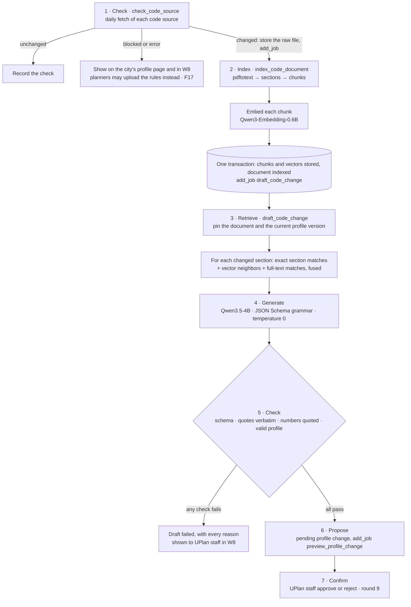

# UPlan — System Architecture

**Status:** Draft — system-level technical design
**Last updated:** 2026-09-12
**Derived from:** [charter.md](../Requirements/charter.md), [intents.md](../Requirements/intents.md), [features.md](../Requirements/features.md)
**Related:** [tech-stack.md](tech-stack.md) · [data-model.md](data-model.md) · [alternatives-and-tradeoffs.md](alternatives-and-tradeoffs.md)

This document sets the shape every feature's TechDesign doc builds on. A feature doc adds detail; it doesn't contradict this document without changing it first.

## Constraints

- **Zero cost.** Every service is open-source software, or a free tier used within its limits (see _Free-tier budget_). There is no paid API, and no paid tier held in reserve.
- **Few external services.** Oracle Cloud Infrastructure's Always Free tier provides all of the infrastructure. The only other external services are GitHub, which already hosts the code, Let's Encrypt, which issues the TLS certificate, and Supabase Auth, which handles sign-in (D14). Public data, model files, and the basemap extract are downloads from free public sources, and the city provides a DNS name.
- **Minimal configuration.** One VM runs everything from one Compose file. A managed service is used only where the VM can't do the job itself: object storage, admin access, and monitoring from outside the VM.
- **Sized for the free VM.** Since June 15, 2026, Always Free Arm compute is 2 OCPUs and 12 GB of memory in total. Every process fits in that, including the language models.

## Assumptions for open product questions

Round 10 is unanswered. The design follows the recommended options, and each one is contained so that a different answer changes one module, not the schema.

| Open question                          | Assumed                                                                               | If the answer differs                                                                                     |
| -------------------------------------- | ------------------------------------------------------------------------------------- | --------------------------------------------------------------------------------------------------------- |
| What a vesting setting does            | A rule set marked as vesting uses the rules in force on the application's filing date | _Warn only:_ `rulesInForce` runs for both dates and the run flags the differences                         |
| Who approves profile uploads and edits | UPlan staff, and never the person who proposed the change _(changed 2026-09-27, when reviewer memberships were removed)_ | _No approval:_ the change applies at submit. _A city reviewer:_ returns with F12's per-project or per-city grant |
| Cities beyond Sammamish in v1          | Sammamish only                                                                        | Every table is already keyed by jurisdiction. More cities need evidence coverage, not a new design        |
| Automatic code tracking in release 1   | Upload first; F2 ships later in v1                                                    | F2 moves into release 1, and the `models` container ships with it. Its module is designed here either way |

## Architecture diagram

Codes match the key below the diagram. Dashed boxes and items marked _later_ arrive later in v1; everything else ships in release 1. Each arrow points from the component that starts the exchange. Solid arrows run while the app is in use; dotted arrows are setup, deploy, or occasional steps.

```mermaid
%%{init: {"flowchart": {"wrappingWidth": 480}}}%%
flowchart LR
  subgraph PEOPLE["People"]
    U12["U1 · Planner<br/>U2 · Reviewer<br/>U4 · Phone look-up · F15 · later"]
    U3["U3 · UPlan staff"]
  end

  subgraph CITY["Provided by the city"]
    C1["C1 · DNS record<br/>city hostname → reserved IP"]
  end

  subgraph OCI["Oracle Cloud Infrastructure · Always Free"]
    O3["O3 · APM synthetic monitor<br/>alarms email UPlan staff"]
    O2["O2 · Bastion<br/>admin sessions"]
    subgraph VM["V1 · Arm VM · 2 OCPUs · 12 GB · 200 GB disk · Ubuntu 24.04 LTS · Docker Compose"]
      V2["V2 · caddy<br/>HTTPS · HTTP/3 · basemap file"]
      V5[("V5 · postgres<br/>PostgreSQL 18 · PostGIS 3.6 · pgvector 0.8<br/>app data · job queue · retrieval index")]
      V3["V3 · web · Next.js 16<br/>―――――――――――――――<br/>W1 · Sign-in and roles · F11<br/>W2 · City profile: view, edit settings and sources · F1 F17<br/>W3 · Projects: dashboard, details, study area, footprint, overview · F5 F8 F18 F20<br/>W4 · Map workspace and evidence tiles · F6 F3 F4<br/>W5 · Phases: evidence, screening, studies, impact, review · F7 F9 F14 F19 F21<br/>W6 · Final document: finish, versions, download · F10 F22<br/>W7 · Records retention and export · F16<br/>W8 · Code change drafts · F2 · later<br/>W9 · Sign-off F12 · conditions F13 · phone F15 · later<br/>W10 · Health check"]
      V4["V4 · worker · graphile-worker<br/>―――――――――――――――<br/>J1 · withdrawn 2026-10-04<br/>J2 · run_analysis · F7 F9 F14<br/>J3 · apply_effective_dates · daily · F1<br/>J4 · ingest_dataset · scheduled · F3<br/>J5 · release_report · F10 F22<br/>J6 · flag_retention, build_records_export · F16<br/>J7 · check_code_source · daily · F2 · later<br/>J8 · index_code_document · F2 · later<br/>J9 · draft_code_change · F2 · later<br/>J10 · record_heartbeat · every 5 minutes"]
      V6["V6 · models · llama.cpp server · later<br/>Qwen3.5-4B drafts · Qwen3-Embedding-0.6B embeds"]
      V7["V7 · migrate · once per deploy"]
      V8["V8 · backup timer · systemd · pgBackRest"]
      V9["V9 · deploy script<br/>build · migrate · restart"]
    end
    O1[("O1 · Object Storage<br/>objects · backups")]
  end

  subgraph OUTSIDE["Other free services"]
    G1["G1 · GitHub repository and Actions CI"]
    G2["G2 · Supabase Auth · email and password sign-in"]
    E1["E1 · Let's Encrypt · TLS certificates"]
  end

  subgraph SOURCES["Free public sources"]
    X1["X1 · Public GIS data"]
    X2["X2 · City code and ordinances · later"]
    X3["X3 · Protomaps basemap builds"]
    X4["X4 · Hugging Face model files · later"]
  end

  U12 -->|"HTTPS"| V2
  U3 -->|"HTTPS"| V2
  C1 -.->|"resolves to the VM"| V2
  O3 -->|"GET /api/health every 10 minutes"| V2
  U3 -->|"admin session"| O2
  O2 -->|"SSH"| V9
  V2 -->|"certificate requests"| E1
  V2 -->|"reverse proxy"| V3
  V2 ~~~ V4
  V2 -.->|"basemap extract, downloaded on purpose"| X3
  V3 -->|"W1 · sign-in and registration"| G2
  V3 -->|"SQL · add_job in the same transaction · vector tiles"| V5
  V3 -->|"uploads · downloads"| O1
  V4 -->|"job pickup · pinned reads · results · retrieval"| V5
  V4 -->|"raw files · exports"| O1
  V4 -->|"J4 · download datasets"| X1
  V4 -->|"J7 · fetch documents · later"| X2
  V4 -->|"J8 J9 · embed, generate JSON drafts · later"| V6
  V6 -.->|"model files at setup, SHA-256 checked"| X4
  V9 -.->|"fetch a tested tag"| G1
  V9 -->|"runs"| V7
  V7 -->|"migrations"| V5
  V8 -->|"daily backup"| V5
  V5 -->|"WAL archive · backups"| O1

  classDef later stroke-dasharray: 6 4
  class V6,X2,X4 later
```

## Key

### People and the city

| Key | Component              | Role                                                                                         | Cost to UPlan                               |
| --- | ---------------------- | -------------------------------------------------------------------------------------------- | ------------------------------------------- |
| U1  | Planner                | Every signed-in person: builds projects, works through their phases, and publishes document versions | —                                   |
| U2  | Reviewer (later)       | Signs off documents once F12 ships, with a per-project grant. Not in release 1                | —                                           |
| U3  | UPlan staff            | Sets up cities and datasets, approves profile changes, exports records, confirms code change drafts, deploys, and receives alarm emails | —                                           |
| U4  | Phone look-up          | A planner or reviewer opening a decision's map and report on a phone (F15, later)            | —                                           |
| C1  | City DNS record        | Points the hostname the city chooses, such as `uplan.sammamish.us`, at the VM's reserved IP  | None: the city's existing DNS               |

### Oracle Cloud Infrastructure — Always Free

| Key | Component                                               | Role                                                                                                                                                       | Free allowance                                                                      |
| --- | ------------------------------------------------------- | ---------------------------------------------------------------------------------------------------------------------------------------------------------- | ----------------------------------------------------------------------------------- |
| V1  | Arm VM (`VM.Standard.A1.Flex`)                          | Runs every UPlan process under Docker Compose on Ubuntu Server 24.04 LTS                                                                                   | 2 OCPUs and 12 GB in total; 200 GB of block storage; 10 TB of outbound data a month |
| O1  | Object Storage                                          | Buckets reached through the S3 compatibility API: `objects` and `backups`. Published documents are not here: they are in the database (see _Object storage_ in the data model) | 20 GB, and 50,000 requests a month                                                  |
| O2  | Bastion                                                 | Time-limited SSH sessions for administration and deploys, so the VM exposes no SSH port to the internet                                                    | Free                                                                                |
| O3  | APM synthetic monitor, Monitoring alarms, Notifications | Calls the health check from outside the VM every 10 minutes, and emails UPlan staff when it fails or Object Storage nears its free limits                  | 10 monitor runs an hour; 1,000 notification emails a month                          |

### Containers and scripts on the VM

| Key | Component        | What it runs                                                                                                                                                                                | Serves                     |
| --- | ---------------- | ------------------------------------------------------------------------------------------------------------------------------------------------------------------------------------------- | -------------------------- |
| V2  | `caddy`          | Caddy 2.11: HTTPS with automatic Let's Encrypt certificates, HTTP/3, a reverse proxy to `web`, and the basemap file with byte ranges. The only container that publishes ports               | Every request from outside |
| V3  | `web`            | Next.js 16: pages, Server Functions, and route handlers for uploads, downloads, tiles, sign-in, and the health check. It never runs long work: anything slower than a request becomes a job | W1–W10                     |
| V4  | `worker`         | graphile-worker, running at most two jobs at once and serving no HTTP. Its image carries Chromium, GDAL, and Poppler                                                                        | J1–J10                     |
| V5  | `postgres`       | PostgreSQL 18 with PostGIS 3.6 and pgvector 0.8: relational and spatial data, the job queue, and the retrieval index. pgBackRest archives its WAL                                 | `web`, `worker`, `migrate` |
| V6  | `models` (later) | llama.cpp's server in router mode, reachable only from `worker`. Qwen3.5-4B drafts profile changes; Qwen3-Embedding-0.6B turns text into vectors. Both stay loaded                          | J8, J9                     |
| V7  | `migrate`        | Applies database migrations once per deploy, before new containers start                                                                                                                    | Deploys                    |
| V8  | Backup timer     | A systemd timer on the host that runs pgBackRest backups inside `postgres` and records each run                                                                                             | Recovery                   |
| V9  | Deploy script    | `deploy/deploy.sh <tag>`: fetches a tag whose CI passed, builds the images on the VM, runs `migrate`, and restarts `worker` and `web`                                                       | Deploys                    |

### Areas of the web app (V3)

| Key | Area                       | Features   | What happens there                                                                                                              |
| --- | -------------------------- | ---------- | ------------------------------------------------------------------------------------------------------------------------------- |
| W1  | Sign-in                    | F11        | Everyone registers and signs in with email and password through G2. Everyone is a planner and sees only the projects they created; a `staff_member` row adds the staff rights |
| W2  | City profile               | F1, F17    | View the profile and its settings, download the template, upload a workbook or edit a rule, compare previews, approve or reject |
| W3  | Projects                   | F5, F8, F18, F20 | The dashboard after sign-in; create a project (or with sample data); edit its details and filing date; save study area and footprint revisions by drawing, upload, or sample; the stage rail and Overview; delete from view |
| W4  | Map workspace              | F6, F3, F4 | MapLibre shows evidence tiles PostGIS makes per dataset version, the basemap from `caddy`, and each layer's provenance          |
| W5  | Phases                     | F7, F9, F14, F19, F21 | For each phase: what it is drafted from, the drafted output, the planner's review, and the history. The evidence and its attributes, disagreements and resolutions, gaps, the screening register, study flags, and impact ranges |
| W6  | Final document             | F10, F22   | The finish checklist, the reason for a new version, the version history, download of any version, and starting or cancelling a research change |
| W7  | Records                    | F16        | Review retention flags; request and download records exports                                                                    |
| W8  | Code change drafts (later) | F2         | UPlan staff read a draft beside its quoted passages and preview results, then approve or reject it                              |
| W9  | Later in v1                | F12, F13, F15 | Review and sign-off, conditions tracing, and phone look-up views                                                             |
| W10 | Health check               | —          | `GET /api/health`, called by O3 (see _Operations_)                                                                              |

### Jobs in the worker (V4)

| Key | Job                                      | Features          | Queue               | What it does                                                                                      |
| --- | ---------------------------------------- | ----------------- | ------------------- | ------------------------------------------------------------------------------------------------- |
| J1  | _withdrawn 2026-10-04_                   | F1, F17           | —                   | Was `preview_profile_change`; a profile change now applies at once and has nothing to preview     |
| J2  | `run_analysis`                           | F7, F9, F14       | `decision:<id>`     | Computes the evidence base, screening, study flags, and impact in PostGIS from pinned inputs      |
| J3  | `apply_effective_dates`                  | F1, F14           | `jurisdiction:<id>` | Daily: queues runs for open decisions when a rule takes effect or is repealed, or when the latest run's results version is out of date |
| J4  | `ingest_dataset`                         | F3                | `dataset:<id>`      | Scheduled: downloads and hashes a source, loads it with GDAL, and publishes a new dataset version |
| J5  | `release_report`                         | F10, F22          | `decision:<id>`     | Renders the document from pinned records, prints the tagged PDF, stores it in the database as the next version, and completes the project. After its last retry it records the failure |
| J6  | `flag_retention`, `build_records_export` | F16               | `jurisdiction:<id>` | Daily: flags records whose retention period ended. On request: builds a records export            |
| J7  | `check_code_source` (later)              | F2                | `code-source:<id>`  | Daily: fetches a code source and records whether it's unchanged, changed, blocked, or failing     |
| J8  | `index_code_document` (later)            | F2                | `rag`               | Converts a changed document to text, splits it by section, embeds the sections, and stores them   |
| J9  | `draft_code_change` (later)              | F2                | `rag`               | Retrieves context, generates a draft profile change, checks it, and proposes it                   |
| J10 | `record_heartbeat`                       | —                 | none                | Every 5 minutes: records that a worker is alive, for the health check                             |

### Other free services and public sources

| Key | Component                        | Role                                                                                    | Cost                                                              |
| --- | -------------------------------- | --------------------------------------------------------------------------------------- | ----------------------------------------------------------------- |
| G1  | GitHub repository and Actions    | Holds the code, runs CI on every pull request, and serves the tags that deploys fetch   | Free plan: 2,000 Actions minutes a month for a private repository |
| G2  | Supabase Auth                    | Holds each person's email, name, and password hash, and their sign-in session           | Free plan: 50,000 monthly active users; paused after a week idle  |
| E1  | Let's Encrypt                    | Issues and renews the TLS certificate for the city's hostname                           | Free                                                              |
| X1  | Public GIS data                  | County, state, and federal datasets that F3 ingests                                     | Free public data _(round 9)_                                      |
| X2  | City code and ordinances (later) | The published code and adopted ordinances that F2 watches                               | Free public records                                               |
| X3  | Protomaps basemap builds         | Where the basemap extract for the city's area comes from, built from OpenStreetMap data | Free, with OpenStreetMap attribution                              |
| X4  | Hugging Face (later)             | Where the open model files are downloaded from, once, at setup                          | Free                                                              |

## Modules

All domain logic lives in modules under `src/modules/`. Routes and job handlers stay thin: authenticate, call one module function, translate the result. Modules reach each other only through each module's `index.ts`.

| Module          | Features          | Owns                                                                                     | Release     |
| --------------- | ----------------- | ---------------------------------------------------------------------------------------- | ----------- |
| `accounts`      | F11               | Sign-in wiring for Supabase Auth, staff members, the staff check. No memberships        | 1           |
| `profiles`      | F1, F17           | Profile schema, versions, changes and approvals, uploads, Excel template, `rulesInForce` | 1           |
| `provenance`    | F4                | The provenance type every figure carries, and its one formatter                          | 1           |
| `evidence`      | F3, F19           | Datasets and their attributes, versions, ingestion, tiles, dataset mapping per city      | 1           |
| `decisions`     | F5, F8            | Decisions, study area and footprint revisions                                            | 1           |
| `analysis`      | F7, F9, F14, F19  | Analysis runs, evidence base, impact engine, screening and study flags, source resolutions, previews | 1           |
| `workflow`      | F18, F20–F22      | Phases and their drafted outputs, planner reviews (`phase_review`), the stage rail and Overview, the dashboard summaries, finishing and cancelling a research change | 1 |
| `reports`       | F10, F22; later F12 | The document, its versions, PDF rendering, storage in the database                     | 1           |
| `records`       | F16               | Retention flags, records exports                                                         | 1           |
| `operations`    | —                 | The health check, the worker heartbeat, and backup run records                           | 1           |
| `code-tracking` | F2                | Code sources, checks, the retrieval index, and drafting                                  | Later in v1 |
| `conditions`    | F13               | Conditions and their links to impacts                                                    | Later in v1 |

- F6 (map workspace) and F15 (phone look-up) are UI: routes in `src/app/` and components in `src/ui/`, built on the modules above.
- F14 (study scoping) extends `analysis` instead of adding a module, because it runs the same engine. F19's resolutions live in `analysis` too, since it owns the disagreement they refer to.
- F18 needs a module of its own, `workflow`, because it reads `decisions`, `analysis`, `profiles`, and `reports`, and `analysis` and `reports` already import `decisions`, so placing the combination in any one of them would create an import cycle. It sits above them and nothing imports it but routes and the worker, so it adds no cycle. It owns one table, `phase_review` (F21), and it is the one place that starts a document (F22), because that needs the planner's reviews and `reports` can't import `workflow`. `reports` receives what it needs as arguments: the snapshot, and the worker-injected drafting function.
- Clients for PostgreSQL, Object Storage, and the model server live in `src/platform/`. Only `code-tracking` calls the model server.

## Key flows

### Profile upload or edit (F17, F1)

Changed 2026-10-04: a change applies the moment it is saved. There is no pending state, preview, or review (see `profile-upload-edit.md`).

1. A planner uploads a workbook (a source) or saves the settings panel. Each form carries the profile revision its page showed.
2. `profiles` parses the document and validates it against the profile schema and the current template version. On any error the planner gets the complete list of problems, and nothing is stored except the upload record.
3. One transaction applies the change:
   - Lock the jurisdiction row.
   - Confirm the revision the form carried is still current, or fail with a conflict.
   - Insert the `profile_change`, already approved by its author, and the new `profile_version`, and move the current pointer.
   - For a workbook, record its `profile_source`.
   - Enqueue `run_analysis` for every open decision in the city.

### Analysis run (F7, F9)

1. A run is triggered by a new profile version, a new dataset version, a rule reaching its effective or repeal date, or a saved study area, footprint, or filing date.
2. The job runs on queue `decision:<id>` with job key `run_analysis:<id>`. Runs for one decision never overlap, and pending duplicates collapse into one.
3. In one read-only transaction, the job reads the current geometry revisions, the rules in force, and the current dataset versions, then computes `input_sha256`. If a run with that hash exists, the job stops.
4. PostGIS computes the evidence base and the impacts (see _Impact engine_).
5. The run stores its pinned inputs and results, and becomes immutable when it finishes.
6. The workspace shows the new run beside the previous one, with what changed.

### Finishing research and publishing a document version (F10, F22)

1. Every phase has a review of its current output (F21), and the analysis for the current inputs has finished. The planner finishes research from the Report page, giving a reason for any version after the first.
2. One transaction does the claim (`finishResearch`):
   - Lock the decision row `FOR UPDATE`. Every input write, review, delete, and start of a research change takes the same lock.
   - Check that the project is `in_progress`, and that no input changed after the page was loaded (the row version and each phase's output fingerprint).
   - Read the current run and each phase's latest review, and check that every phase is reviewed at its current output and, for a research change, that something changed.
   - Compare-and-set the decision `in_progress → finishing`, insert the `report` as `releasing` with the review snapshot, and enqueue `release_report`.
3. While `finishing`, the project is read-only. The worker renders the HTML from pinned records (the run, its recorded geometry revisions, its profile version, and the snapshot), prints the tagged PDF, and in one transaction stores it in `report.pdf` with its SHA-256 as the next `version_number`, and moves the decision `finishing → report_released`.
4. A published row is immutable: a trigger rejects any update or delete. A retried job that finds the row already released does nothing. After the last retry, the report is marked `failed`, the decision returns to `in_progress`, and the failure is shown.

A profile approval or dataset refresh that lands after step 2 doesn't touch the document: it is built from the pinned run, and its requeue skips projects that aren't `in_progress`.

### Research change (F22)

1. The planner starts a research change from the dashboard, the Overview, or a phase page. One compare-and-set moves the decision `report_released → in_progress` and enqueues a fresh analysis in the same transaction.
2. The planner changes inputs (a boundary drawn, uploaded, or loaded from sample data; the details; a resolution note) and the analysis reruns. Each phase's output is compared by fingerprint with the last published version, and the changed phases ask for review.
3. Finishing publishes the next version (above). A change that changed nothing can be cancelled instead, moving the decision back to `report_released`.

### Dataset refresh (F3)

1. A scheduled `ingest_dataset` job runs on queue `dataset:<id>`. It downloads the source into the `objects` bucket and hashes it. An unchanged hash updates `last_checked_at` and stops.
2. GDAL loads the data into a staging table. SQL validates it and repairs invalid source geometries, recording the repair count in the version's processing steps. It then writes `evidence_feature` rows for a new `dataset_version`.
3. One transaction locks the dataset row, marks the version ready, moves the current pointer, and enqueues `run_analysis` for open decisions whose study areas intersect the dataset's coverage.
4. Any failure marks the version failed with its error. The previous version stays current, and every view of that dataset shows the failed refresh beside it.

## Drafting code changes with retrieval (F2, later in v1)

F2 drafts rule updates with a retrieval-augmented generation (RAG) workflow that runs entirely on the VM. The worker retrieves passages from PostgreSQL and calls the open models in the `models` container. No text goes to an external AI API.

1. **Check.** `check_code_source` runs daily for each source on queue `code-source:<id>`, with `max_attempts` 5. It records one outcome: unchanged, changed, blocked (the site refuses automated reading, as with HTTP 401 or 403), or error. A blocked or failing source shows on the city's profile page and in W8, and planners may choose to upload the rules instead (F17). A changed document is first stored in the `objects` bucket under its SHA-256; then one transaction records the check and enqueues `index_code_document`.
2. **Index.** `index_code_document` runs on queue `rag`, with `max_attempts` 3:
   - Poppler's `pdftotext -layout` converts the PDF to text. A PDF without a text layer fails with that reason. There is no OCR, and no guessing at text.
   - The text is split along the code's own structure (chapter, section, subsection), so every chunk carries its section path and heading. A table stays whole in one chunk.
   - Qwen3-Embedding-0.6B embeds every chunk.
   - One transaction stores the chunks and their vectors, marks the document indexed, and enqueues `draft_code_change`.
3. **Retrieve.** `draft_code_change` runs on queue `rag`, with `max_attempts` 3. It pins the document and the city's current profile version, and finds the sections that are new or changed since the source's previous document. For each changed section, the prompt gets:
   - the section's new text;
   - the current rules whose citations name that section;
   - the 8 most relevant chunks from the city's indexed code. One SQL query ranks chunks three ways and fuses the rankings with reciprocal rank fusion: exact section-path references, nearest neighbors through pgvector's HNSW index, and full-text matches.
4. **Generate.** Qwen3.5-4B runs with thinking off and temperature 0. A JSON Schema grammar constrains its output to a list of rule operations (add, amend, or repeal), each with its values, citation, effective date, and evidence given as a chunk id and an exact quote. The schema has no free-text field, so the model has nowhere to write a finding or a recommendation.
5. **Check.** Deterministic checks, all of which must pass:
   - The output parses against the Zod schema.
   - Every quote appears verbatim in the chunk it cites, and that chunk was retrieved for this draft.
   - Every number in a rule appears in its quote.
   - Applying the operations to the pinned profile produces a document that passes `ProfileDocumentSchema`.

   A draft that fails is stored as failed, with every reason. It is never retried with another prompt or model.

6. **Propose.** A passing draft becomes a pending `profile_change` with source `code_change`, in the transaction that finishes the draft. (The `preview_profile_change` job this once enqueued was withdrawn 2026-10-04; F2 decides how staff see a draft before they confirm it.) If the city already has a pending change, the draft waits. The transaction that decides that change enqueues `draft_code_change` again: unchanged inputs propose the waiting draft, and a new profile version produces a new draft against it.
7. **Confirm.** UPlan staff read the draft beside its quoted passages and the preview results, and approve or reject it _(round 9)_. A correction is a new edit that cites the draft.

Every draft records what produced it: the document hash, the profile version, the SHA-256 of each model file, the prompt version, the retrieved chunk ids and ranks, and the raw model output. Both model jobs share the `rag` queue, so only one runs at a time, and `models` has a low CPU weight, so a draft that takes minutes yields the CPU to pages and analysis runs.

## Impact engine

- Inputs are pinned: geometry revisions, rules in force, dataset versions.
- Every measurement happens after `ST_Transform` to the jurisdiction's `analysis_srid`. Areas are in square US survey feet and lengths in US survey feet.
- For each resource type, the engine measures mapped features inside the footprint and each applicable buffer inside the footprint.
- **When a rule depends on an attribute the evidence doesn't carry**, such as a wetland's field rating, the engine computes every allowed value and reports the range and what it depends on. It never assumes a value.
- Results for resource types the profile marks as approximate are flagged approximate everywhere they appear.
- Each result carries the rule keys and evidence features it came from. Provenance (F4) and conditions tracing (F13) build on these.
- Results are ordered deterministically, so the same inputs always produce the same results document.

## Rules in force

- Every rule entry in a profile document carries `effectiveOn` and `repealedOn`, which stays null while the rule is in force.
- Amending a rule adds a new entry with the same rule key and sets the old entry's `repealedOn`. Entries are never deleted, so the current document holds each rule's history.

`rulesInForce(document, onDate)` is the single function that resolves rules for every case:

- A rule set not marked as vesting uses the rules in force today, in the city's time zone.
- A rule set marked as vesting uses the rules in force on the application's filing date _(assumed; round 10)_. If the filing date is missing, the run fails with a validation error that names it.
- A daily `apply_effective_dates` job per city enqueues analysis runs for open decisions when any rule's `effectiveOn` or `repealedOn` falls on that day. Results never silently lag a rule taking effect.
- Each run records the profile version and the date it resolved each rule set for.

## Concurrency and consistency

Race conditions are prevented by design, not by timing:

1. **Immutable records.** Profile versions, uploads, ready dataset versions, evidence features, geometry revisions, finished analysis runs, released reports, indexed documents, and finished drafts never change. A change makes a new row.
2. **One writer per invariant.** Each invariant has one writing function, and a database constraint backs it.
3. **Compare-and-set transitions.** A state change is an `UPDATE … WHERE` on the expected state. It must change exactly one row, or it raises a `ConflictError`.
4. **Pointers move under locks.** A "current version" pointer moves only under `SELECT … FOR UPDATE`, in the same transaction that creates the new version.
5. **Transactional enqueue.** Jobs are added with `graphile_worker.add_job()` inside the transaction that needs them. There is never a change without its job, or a job without its change.
6. **Serialized related work.** Jobs for one aggregate share a named queue: `decision:<id>`, `jurisdiction:<id>`, `dataset:<id>`, or `code-source:<id>`. Jobs that use the models share the one `rag` queue. Job keys collapse pending duplicates. If a duplicate is added while a job runs, the running job finishes first and the new one runs after it.
7. **Pinned inputs.** Every run, report, and draft records the exact versions it read. No reader combines versions.
8. **Idempotent handlers.** A job rerun after a crash creates no duplicates, keyed by input hash, content hash, or report id.
9. **No in-process coordination.** No module-level mutable state, in-memory locks, or in-memory queues. The design holds with any number of web and worker instances, even though the VM runs one of each.
10. **Honest clients.** The browser sends the revision its edit was based on, blocks double submission, and discards responses to superseded requests. It never shows a number it computed itself.

| Situation                                                  | What prevents the race                                                                                                              |
| ---------------------------------------------------------- | ----------------------------------------------------------------------------------------------------------------------------------- |
| Two planners propose profile changes for one city          | Partial unique index: one pending change per city                                                                                   |
| An approval is clicked twice                               | The compare-and-set on `status = 'pending'` lets only one click through                                                             |
| Rules change while an analysis runs                        | The run pinned its inputs, and the approval queued a new run behind it on the same queue                                            |
| Finishing races an input change or a review               | Both take `FOR UPDATE` on the decision row, so they serialize. The finish rereads every fingerprint inside the lock                 |
| Two people finish one project at once                      | The `in_progress → finishing` compare-and-set lets exactly one through                                                              |
| Two saves of the same footprint                            | The primary key on (decision, kind, revision) rejects the second save                                                               |
| The same workbook is submitted twice                       | Unique (jurisdiction, file hash)                                                                                                    |
| A worker crashes mid-job                                   | The job is retried, and the handler is idempotent                                                                                   |
| A document was rendered but not yet stored                 | The retry renders again from the same pinned records and stores once: the store is a compare-and-set from `releasing`              |
| A rule takes effect at midnight during a finish            | The analysis status hashes the rules in force, so the finish either sees the new rule set and an out-of-date run, or the old one   |
| A code change is drafted while a profile change is pending | The one-pending index makes the draft wait. Deciding the pending change re-enqueues the draft against the version then current      |
| The same code document is fetched twice                    | Checks of one source run in series on `code-source:<id>`, and unique (source, content hash, embedding model) stores a document once |
| Two model jobs start at once                               | Both are on the `rag` queue, so the second waits for the first                                                                      |
| Two deploys start at once                                  | The deploy script holds an exclusive lock on the VM, and migrations run only in the one-off `migrate` container                     |

## Failure handling

- **Expected outcomes are typed errors.** `ValidationError`, `ConflictError`, `ForbiddenError`, and `NotFoundError` reach the user with specifics: which field, which pending change, which newer revision.
- **Everything else is a defect.** It propagates, is logged once with the request or job id, and is shown as a failure. Nothing catches an error in order to continue.
- **No fallbacks.**
  - No default for missing required data.
  - No substitute data source.
  - No cached copy served when a fetch fails.
  - No silent repair of geometry a person drew.
  - No parsing of an unknown template version.
  - No substitute model or AI service when `models` is down: the job fails and retries.
- **Bounded retries are not fallbacks.** Retrying the same idempotent job is allowed, and every job sets `max_attempts`: 3 for computation, 5 for network fetches. After the last attempt, the owning row is marked failed with its error, the UI shows it, and the health check fails, so the alarm emails UPlan staff.
- **The previous dataset version stays current only in plain view.** It is correct to show the last good version only because the failed refresh is shown right beside it.
- **Configuration fails fast.** At startup each process validates its environment with Zod and exits if anything is missing.

## Security and access

- **Sign-in:** everyone registers and signs in with an email address and a password through Supabase Auth, called only from the server. Registering grants no staff rights: only a `staff_member` row does, and there is no membership. Session cookies are `HttpOnly` and `SameSite=Lax`, and `Secure` in production.
- **Personal data outside the VM.** The one exception to keeping personal data on the VM (D14): Supabase holds each person's email, name, and password hash. No decision, applicant, or evidence data goes to it.
- **Authorization lives in modules.** Module functions take the signed-in actor. A project function checks that the actor created the project, inside the query itself; a staff function checks `staff_member`. `src/proxy.ts` only redirects signed-out page visits, because the Next.js docs warn that a matcher change can silently remove Proxy coverage.
- **Roles:**
  - _Planner:_ every signed-in person: builds projects, works through their phases, proposes profile changes, and publishes document versions.
  - _UPlan staff:_ approves profile changes (never their own), sets up jurisdictions and datasets, installs sample evidence, exports records, confirms code-change drafts, and operates the VM.
  - _Reviewer:_ returns with F12, with a per-project grant.
- **Every query of a project is scoped to its owner.** A project that isn't the actor's, is deleted, or is absent reads as "not found".
- **Network:** the VM's security list allows inbound TCP 80 and 443 and UDP 443 from the internet, and SSH only from the Bastion. Only `caddy` publishes ports. `web`, `worker`, `postgres`, and `models` are reachable only on the Compose network.
- **Uploads:** `.xlsx` only, at most 5 MB, parsed with row limits.
- **Immutability is enforced in two places.**
  - In the database, the application's role can't update or delete immutable tables, and triggers block changes to finished runs, published documents (and every delete of one), phase reviews, source resolutions, ready dataset versions, indexed documents, and finished drafts.
  - In Object Storage, the application's credentials can create and read objects but never overwrite or delete them. Published documents are not in Object Storage since 2026-09-27; they are in the database, behind the trigger above.
- **Secrets** live in two root-only files on the VM, one for the application containers and one for `postgres` and its backups, never in the repository, images, or logs.
- **Models run on the VM** and receive only public code text. No UPlan data goes to an external AI API.
- **Content Security Policy** allows MapLibre's blob workers and nothing broader.

## Accessibility

- WCAG 2.1 AA across the app, checked with axe in end-to-end tests.
- Everything the map shows is also available as text: impacts, evidence, and provenance in tables.
- Released PDFs are tagged and have an outline. Every SVG map has a title and description, and tables have header cells.
- Placing footprint vertices doesn't depend on the path of a pointer, so WCAG 2.1.1 requires a keyboard way to do it. The proposal-footprint design must provide one.

## Deployment

### The VM and its containers

- One `VM.Standard.A1.Flex` instance with 2 OCPUs, 12 GB of memory, and a 200 GB boot volume, in the tenancy's home region in the western US. It runs Ubuntu Server 24.04 LTS with unattended security upgrades, and Docker Engine with the Compose plugin.
- The tenancy is upgraded to Pay As You Go. Oracle doesn't charge for Always Free resources after the upgrade, a paid tenancy can open support tickets, and users report that upgrading stops Oracle from reclaiming idle Always Free instances. A budget alert at one dollar catches anything that would cost money.
- A reserved public IP, at no charge, keeps the city's DNS record valid when the VM is rebuilt.

| Container  | Built from                                                                                                               | Memory limit | Ships                      |
| ---------- | ------------------------------------------------------------------------------------------------------------------------ | ------------ | -------------------------- |
| `caddy`    | `caddy:2.11`                                                                                                             | 256 MB       | Release 1                  |
| `web`      | Dockerfile target `web`, on `node:24-slim`                                                                               | 1 GB         | Release 1                  |
| `worker`   | Dockerfile target `worker`, on the Playwright image with GDAL and Poppler added                                          | 2 GB         | Release 1                  |
| `postgres` | Dockerfile target `postgres`, on `postgres:18` with PostGIS, pgvector, and pgBackRest from the PostgreSQL apt repository | 3 GB         | Release 1                  |
| `models`   | `ghcr.io/ggml-org/llama.cpp:server`, pinned by digest                                                                    | 4.5 GB       | With F2                    |
| `migrate`  | Dockerfile target `worker`                                                                                               | —            | Release 1, once per deploy |

- The limits add up to 10.75 GB, leaving about 1.25 GB for the host. Until F2 ships, the memory set aside for `models` serves as page cache for PostgreSQL.
- **Models.** `models` runs llama.cpp in router mode with one presets file, `deploy/models.ini`. The file loads both models at startup and sets each one's context size, embedding pooling, and thinking off. Qwen3.5-4B's Q4_K_M file is 2.74 GB, and Qwen3-Embedding-0.6B's Q8_0 file is 639 MB. `deploy/setup.sh` downloads both once and checks their SHA-256 hashes.
- **CPU.** The two OCPUs are shared. The worker runs at most two jobs at once, model jobs run one at a time on `rag`, and `models` has a low CPU weight (`cpu_shares`), so it yields to pages and analysis runs.

### Deploying

1. GitHub Actions runs CI on every pull request: typecheck, lint, unit tests, integration tests with Testcontainers, and end-to-end tests with axe. A release is a git tag on a commit whose CI passed.
2. UPlan staff open a Bastion session and run `deploy/deploy.sh <tag>`. The script takes an exclusive lock, fetches and checks out the tag, and builds the images on the VM.
3. It runs `migrate`, then recreates `worker` and `web` and waits for their health checks.
4. Migrations are expand-then-contract, so containers still running the old code work against the migrated schema until they're replaced.

Recreating `web` takes a few seconds, so deploys happen outside the city's working hours. Because images are built on the VM, no container registry is needed.

`deployment-guide.md` holds the step-by-step instructions: a demo site first, then what the pilot still needs built.

### Environments

- **Production** is the VM.
- **There is no standing staging environment,** because the free allowance covers one VM. CI instead starts the whole stack for every pull request: PostGIS through Testcontainers, the app, and Playwright.
- **Storage tests** use two development buckets in the same tenancy, with the same create-only permissions as production and a lifecycle rule that deletes objects after a day.
- **Local development** uses the same Compose file with a development override that leaves out `caddy`, against the development buckets.

### Everything that's configured

| Where                       | What                                                                                                                                                                                                                                                                                                                                                                                                                                                      |
| --------------------------- | --------------------------------------------------------------------------------------------------------------------------------------------------------------------------------------------------------------------------------------------------------------------------------------------------------------------------------------------------------------------------------------------------------------------------------------------------------- |
| Oracle Cloud console        | The Pay As You Go upgrade and a one-dollar budget alert. A VCN with one public subnet and its security list. The VM and its reserved IP. Five buckets: three for production and two for development, with the `reports` retention rule and the development lifecycle rules. Three IAM users (application, backups, development), each with a policy and a key. A Bastion. An APM domain with one synthetic monitor. Two alarms and one notification topic |
| The city                    | A DNS record                                                                                                                                                                                                                                                                                                                                                                                                                                             |
| GitHub                      | Repository secrets for the development buckets                                                                                                                                                                                                                                                                                                                                                                                                                                                                                                                                                                                                                                                                                                                                                                              |
| `deploy/` in the repository | `compose.yaml`, `Caddyfile`, `models.ini`, the backup timer and service units, `setup.sh`, and `deploy.sh`                                                                                                                                                                                                                                                                                                                                                |
| Supabase                    | One project: email sign-in on, "Confirm email" off until an SMTP sender exists (D14), and the site URL and `<hostname>/auth/callback` in its redirect list |
| The VM                      | Two root-only secrets files: `/etc/uplan/app.env` for `web`, `worker`, and `migrate`, and `/etc/uplan/postgres.env` for `postgres` and pgBackRest                                                                                                                                                                                                                                                                                                         |

One more setting is not a secret: `UPLAN_HOSTNAME`, the name `caddy` serves and gets its certificate for, lives in the gitignored `deploy/.env` on the VM.

## Operations

### Health check and alarms

`GET /api/health` answers 200, or 503 with the names of the failing checks and nothing else. It fails when:

- the database doesn't answer;
- the worker heartbeat is more than 15 minutes old;
- WAL archiving has failed since its last success, or hasn't archived anything for an hour;
- no backup has succeeded in 26 hours;
- the disk is more than 85% full;
- any job used up its attempts in the last 24 hours.

The heartbeat writes every 5 minutes, which also keeps WAL moving, so a stale archive is a real signal. An OCI APM synthetic monitor calls the health check every 10 minutes, using 6 of the 10 free runs an hour. Two Monitoring alarms email UPlan staff through one Notifications topic: one when the monitor fails, and one when Object Storage use approaches its free storage or request allowance.

### Logs

`web` and `worker` write pino JSON logs to standard output. Docker's `local` log driver keeps and rotates them on the VM, and UPlan staff read them in a Bastion session. There's no log service.

### Backups and recovery

- pgBackRest archives WAL continuously, with `archive_timeout` set to 15 minutes, so a lost VM loses at most 15 minutes of work.
- The backup timer runs at night: a full backup on Sundays and a differential backup on other days. pgBackRest keeps two full backups, and every run is recorded in `backup_run`.
- pgBackRest encrypts backups before they leave the VM. They go to the `backups` bucket, using credentials that reach no other bucket.
- A lost VM is rebuilt with `setup.sh`, restored with pgBackRest, and given the reserved IP, so the city's DNS record doesn't change.
- A restore into a scratch container on the VM is rehearsed every quarter.

### Free-tier budget

| Allowance               | Free limit                                     | Planned use for one city                                                                                         |
| ----------------------- | ---------------------------------------------- | ---------------------------------------------------------------------------------------------------------------- |
| Arm compute             | 2 OCPUs and 12 GB                              | The one VM                                                                                                       |
| Block storage           | 200 GB                                         | One boot volume: OS, images, database, model files, and the basemap file                                         |
| Object Storage          | 20 GB                                          | Backups first, then raw data and exports                                                                         |
| Database size           | Within the 200 GB boot volume                  | Published documents add a few hundred kilobytes each (`report.pdf`); the list queries never read them           |
| Object Storage requests | 50,000 a month                                 | Mostly WAL archiving: at most 96 forced segments a day, plus backups, application objects, and development tests |
| Outbound data           | 10 TB a month                                  | Pages, tiles, and downloads                                                                                      |
| Synthetic monitor runs  | 10 an hour                                     | 6                                                                                                                |
| Notification emails     | 1,000 a month                                  | Alarms only                                                                                                      |
| GitHub Actions          | 2,000 minutes a month for a private repository | CI on pull requests                                                                                              |
| Supabase Auth           | 50,000 monthly active users                    | The pilot's planners, reviewers, and staff: dozens. Projects idle for a week are paused (D14)                    |

A change that raises use of an allowance updates this table in the same change.

## Release 1 in this architecture

- **Release 1** deploys `caddy`, `web`, `worker`, `postgres`, and `migrate`, and builds these modules:
  - `accounts`: planners (everyone signed in) and UPlan staff, who approve profile changes.
  - `profiles`, `provenance`, `evidence`, `decisions`, `records`, and `operations`.
  - `analysis`: evidence base, screening and study flags, impact, and the source resolutions.
  - `workflow`: phases, drafted outputs and reviews, the stage rail, Overview, dashboard summaries, finishing and research changes.
  - `reports`: the document, its versions, and storage in the database, without sign-off.
  - The map workspace UI.
- **Later in v1:** `code-tracking` with the `models` container and the retrieval index, sign-off in `reports`, `conditions`, and the phone look-up views.

Sources: [Oracle: Always Free resources](https://docs.oracle.com/en-us/iaas/Content/FreeTier/freetier_topic-Always_Free_Resources.htm) · [InfoQ: Oracle halves Always Free Ampere A1 limits](https://www.infoq.com/news/2026/07/oracle-cloud-free-tier-limits/) · [Oracle: Free Tier and upgrading](https://docs.oracle.com/en-us/iaas/Content/FreeTier/freetier.htm) · [Oracle: public IP addresses](https://docs.oracle.com/en-us/iaas/Content/Network/Tasks/managingpublicIPs.htm) · [Oracle: Object Storage retention rules](https://docs.oracle.com/en-us/iaas/Content/Object/Tasks/usingretentionrules.htm) · [Oracle: Object Storage policy reference](https://docs.oracle.com/en-us/iaas/Content/Identity/Reference/objectstoragepolicyreference.htm) · [llama.cpp: server README](https://github.com/ggml-org/llama.cpp/blob/master/tools/server/README.md) · [Qwen3.5-4B](https://huggingface.co/Qwen/Qwen3.5-4B) · [Qwen3.5-4B GGUF files](https://huggingface.co/unsloth/Qwen3.5-4B-GGUF) · [Qwen3-Embedding-0.6B GGUF](https://huggingface.co/Qwen/Qwen3-Embedding-0.6B-GGUF) · [Next.js: proxy.ts](https://nextjs.org/docs/app/api-reference/file-conventions/proxy) · [graphile-worker: job keys](https://worker.graphile.org/docs/job-key) · [graphile-worker: add_job](https://worker.graphile.org/docs/sql-add-job) · [W3C: WCAG 2.1, success criterion 2.1.1](https://www.w3.org/TR/WCAG21/#keyboard)
